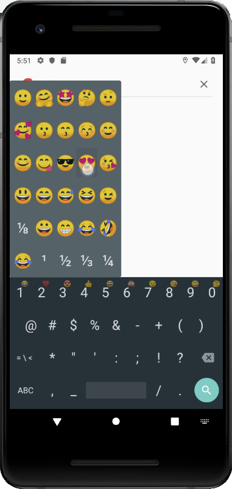

# Simple Keyboard with Emojis

A lightweight and simple keyboard with basic support for Emojis. All basic faces and some specially picked ones are available. IMPORTANT: Not all Emojis are currently accessible!

Forked from https://github.com/rkkr/simple-keyboard wich forked from https://android.googlesource.com/platform/packages/inputmethods/LatinIME/

